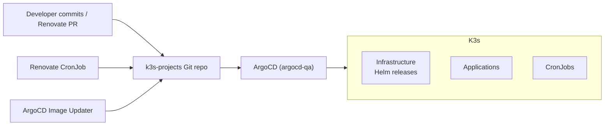

# k3s-projects

GitOps source-of-truth for a 7-node K3s ARM64 dev cluster. Everything
long-lived is owned by ArgoCD; this repo is the single place to describe
infrastructure, Helm releases, and applications.

## Cluster facts

| Item                      | Value                                                         |
| ------------------------- | ------------------------------------------------------------- |
| Distribution              | K3s (ARM64)                                                   |
| Node subnet               | `10.19.94.0/24`                                               |
| Control plane nodes       | `pudge` (10.19.94.151), `crystalmaiden` (10.19.94.152)        |
| Worker nodes              | `mirana` (.153), `juggernaut` (.154), `invoker` (.155)        |
| Longhorn-only nodes       | `longhorn-01` (.156), `longhorn-02` (.157)                    |
| MetalLB LoadBalancer pool | `10.19.94.181 - 10.19.94.200`                                  |
| Ingress edge              | Traefik, VIP `10.19.94.181`                                    |
| Base domain (dev)         | `*.dev.cgraaaj.in` (wildcard via cert-manager + Cloudflare DNS-01) |
| ArgoCD (primary)          | `argocd-qa` namespace → https://argocd.qa.cgraaaj.in          |
| Auth / SSO                | Authentik (`auth.dev.cgraaaj.in`)                             |

## High-level flow



## Directory map

### Infrastructure components (each owns a Helm release via ArgoCD)

| Path                                                       | Release                  |
| ---------------------------------------------------------- | ------------------------ |
| [authentik/](authentik/)                                   | Authentik SSO (IngressRoute, middleware, values) |
| [cert-manager/](cert-manager/)                             | cert-manager + wildcard Certificates + ClusterIssuers |
| [gitlab-runner/](gitlab-runner/)                           | GitLab Runner values                |
| [hashicorpvault/](hashicorpvault/)                         | Vault Helm values + ingress         |
| [kubernetes-replicator/](kubernetes-replicator/)           | mittwald kubernetes-replicator       |
| [longhorn/](longhorn/)                                     | Longhorn + default StorageClass      |
| [metallb/](metallb/)                                       | MetalLB `IPAddressPool` + `L2Advertisement` |
| [minio/](minio/)                                           | MinIO values + ingress               |
| [monitoring/](monitoring/)                                 | kube-prometheus-stack, Loki, Alertmanager router, Istio dashboards & ServiceMonitors |
| [traefik/](traefik/)                                       | Traefik dev + prod values, dashboard, ext-services |
| [argocd/](argocd/)                                         | ArgoCD install (kustomize) + IngressRoutes |
| [argocd-image-updater/](argocd-image-updater/)             | ArgoCD Image Updater values          |
| [renovate/](renovate/) + [renovate.json](renovate.json)    | Self-hosted Renovate CronJob + policy |

### GitOps registry

| Path                                                       | Content                               |
| ---------------------------------------------------------- | ------------------------------------- |
| [argo-registry/qa/manifests/projects/](argo-registry/qa/manifests/projects/) | `AppProject` RBAC boundaries |
| [argo-registry/qa/manifests/infra/](argo-registry/qa/manifests/infra/)       | ArgoCD `Application` per infra Helm release (see its [README.md](argo-registry/qa/manifests/infra/README.md)) |
| [argo-registry/qa/manifests/apps/](argo-registry/qa/manifests/apps/)         | Application workloads (tickerflow, mediaradar, stockx, optionscope) |
| [argo-registry/qa/manifests/cronjobs/](argo-registry/qa/manifests/cronjobs/) | Scheduled jobs                        |
| [argo-registry/prod/manifests/](argo-registry/prod/manifests/)               | Placeholder layout for the future prod cluster |
| [argo-registry/README.md](argo-registry/README.md)         | Registry pull secret + bootstrap order |

### Docs & helpers

| Path                                                       | Content                                                   |
| ---------------------------------------------------------- | --------------------------------------------------------- |
| [docs/istio/README.md](docs/istio/README.md)               | Istio service-mesh deployment guide (consolidated)        |
| [docs/archive/](docs/archive/)                             | Retired manifests and historical reference                |
| [scripts/README.md](scripts/README.md)                     | Operational scripts (Istio deploy, registry secret fan-out) |

## Managed by

- **ArgoCD** — every Helm release and application in the cluster. Entry
  points: [argo-registry/qa/manifests/infra/](argo-registry/qa/manifests/infra/),
  [argo-registry/qa/manifests/apps/](argo-registry/qa/manifests/apps/).
- **Renovate** — dependency updates (Helm charts, container tags) as PRs
  against this repo. Config: [renovate.json](renovate.json). Deployment:
  [renovate/README.md](renovate/README.md).
- **ArgoCD Image Updater** — container image tag updates from
  `registry.cgraaaj.in`. Config: [argocd-image-updater/values.yaml](argocd-image-updater/values.yaml).
- **cert-manager** — wildcard TLS via Let's Encrypt (DNS-01 via Cloudflare).
  Certificates live in [cert-manager/certificates/production/](cert-manager/certificates/production/).

## Bootstrap (fresh cluster)

```bash
# 1. Projects first
kubectl apply -f argo-registry/qa/manifests/projects/

# 2. Infrastructure (ArgoCD handles reconcile order)
kubectl apply -f argo-registry/qa/manifests/infra/

# 3. Applications and cronjobs
kubectl apply -f argo-registry/qa/manifests/apps/
kubectl apply -f argo-registry/qa/manifests/cronjobs/
```

## Secrets policy

- No plaintext secrets are committed. [argo-registry/dockerconfig.json](argo-registry/dockerconfig.json)
  is gitignored — regenerate it locally from a sealed-secret or Vault.
- Dynamic credentials (Redis, PostgreSQL) are issued by Vault via the
  database secrets engine; see [hashicorpvault/README.md](hashicorpvault/README.md).
- Cert-manager issues TLS certificates automatically; rotation is handled
  upstream.

## Recommended follow-ups

1. Rotate the `registry.cgraaaj.in` robot token currently in
   [argo-registry/dockerconfig.json](argo-registry/dockerconfig.json) and
   replace it with External Secrets Operator backed by Vault.
2. Add pre-commit hooks (`detect-secrets`, `yamllint`, `kubeconform`) to block
   drift at commit time.
3. Introduce an `app-of-apps` ArgoCD Application that bootstraps everything
   under [argo-registry/qa/manifests/](argo-registry/qa/manifests/) from a
   single `kubectl apply`.
