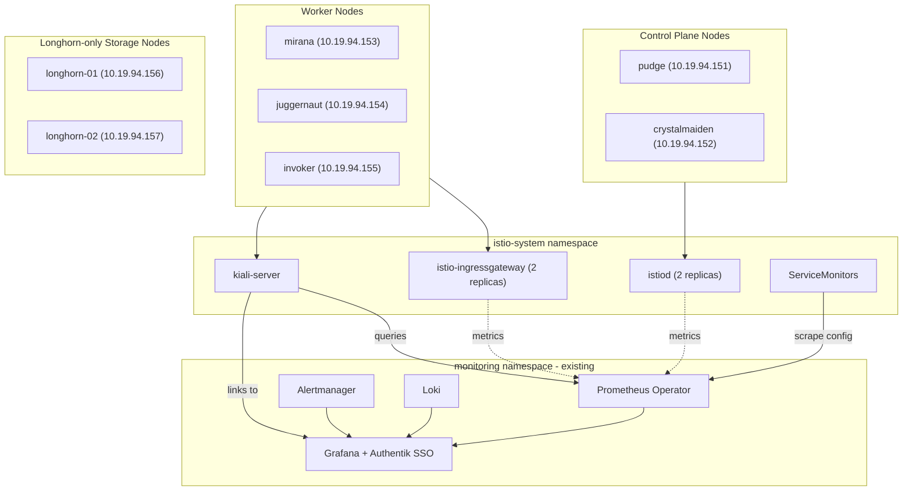

# Istio Service Mesh on K3s (Dev Cluster)

Consolidated guide for deploying Istio on the 7-node K3s ARM64 dev cluster, integrated with the existing `kube-prometheus-stack` so nothing is duplicated.

> This document supersedes the legacy root-level files (`START-HERE.md`,
> `INTEGRATION-SUMMARY.md`, `UPDATED-DEPLOYMENT-GUIDE.md`, `DEPLOYMENT-GUIDE.md`,
> `README-ISTIO.md`). IPs have been updated to the post-migration `10.19.94.0/24` subnet.

---

## 1. Overview

- **Service mesh:** Istio (traditional sidecar mode, ARM64 images).
- **Observability reuse:** Istio metrics are scraped by the existing
  `prometheus-kube-prometheus-prometheus` and visualised in the existing
  Grafana at `https://grafana.dev.cgraaaj.in`.
- **Control:** GitOps via ArgoCD (`argocd-qa`); Applications live in
  [../../argo-registry/qa/manifests/infra/](../../argo-registry/qa/manifests/infra/).
- **Added RAM:** ~1.5 GB across the cluster (well under 4% of the 40 GB total).

---

## 2. Architecture



**Placement rationale**

| Node(s)                      | Workloads                                              |
| ---------------------------- | ------------------------------------------------------ |
| `pudge`, `crystalmaiden`     | `istiod` (control plane, HA pair with anti-affinity)   |
| `mirana`, `juggernaut`, `invoker` | `istio-ingressgateway`, `kiali-server`, app sidecars |
| `longhorn-01/02`             | Longhorn storage only (no Istio workloads)             |

---

## 3. What Gets Deployed

| Manifest                                                                                              | Role                                             |
| ----------------------------------------------------------------------------------------------------- | ------------------------------------------------ |
| [argo-registry/qa/manifests/projects/appproject-infrastructure.yaml](../../argo-registry/qa/manifests/projects/appproject-infrastructure.yaml) | ArgoCD `AppProject` for infra apps |
| [argo-registry/qa/manifests/infra/istio-base.yaml](../../argo-registry/qa/manifests/infra/istio-base.yaml) | Istio CRDs                                       |
| [argo-registry/qa/manifests/infra/istiod.yaml](../../argo-registry/qa/manifests/infra/istiod.yaml)    | Control plane (HA)                               |
| [argo-registry/qa/manifests/infra/istio-ingressgateway.yaml](../../argo-registry/qa/manifests/infra/istio-ingressgateway.yaml) | Data plane ingress (HA)             |
| [argo-registry/qa/manifests/infra/kiali.yaml](../../argo-registry/qa/manifests/infra/kiali.yaml)      | Mesh dashboard, points at existing Prometheus    |
| [argo-registry/qa/manifests/infra/istio-servicemonitors.yaml](../../argo-registry/qa/manifests/infra/istio-servicemonitors.yaml) | Wires Prometheus to scrape Istio     |
| [monitoring/istio-servicemonitors/](../../monitoring/istio-servicemonitors/)                          | Raw `ServiceMonitor`/`PodMonitor` CRs            |
| [monitoring/istio-dashboards/](../../monitoring/istio-dashboards/)                                    | Grafana dashboards                               |

**Not deployed (intentionally):** a second Prometheus, a second Grafana, or a separate Alertmanager — the cluster already has them.

---

## 4. Prerequisites

- `kubectl` context pointing at the dev cluster (`https://10.19.94.151:6443`).
- ArgoCD-QA is reachable at `https://argocd.qa.cgraaaj.in`.
- `kube-prometheus-stack` already installed in namespace `monitoring`
  (managed by the `prometheus` ArgoCD Application).
- MetalLB pool `10.19.94.181-10.19.94.200` available for the Istio ingress gateway LB service.

---

## 5. Deployment (via ArgoCD)

All components are GitOps-managed. Apply the Application manifests once; ArgoCD handles the rest.

```bash
cd /home/cgraaaj/Projects/k3s-projects

# 1. Infrastructure AppProject
kubectl apply -f argo-registry/qa/manifests/projects/appproject-infrastructure.yaml

# 2. Istio core (order-agnostic; ArgoCD respects Sync Waves)
kubectl apply -f argo-registry/qa/manifests/infra/istio-base.yaml
kubectl apply -f argo-registry/qa/manifests/infra/istiod.yaml
kubectl apply -f argo-registry/qa/manifests/infra/istio-ingressgateway.yaml
kubectl apply -f argo-registry/qa/manifests/infra/kiali.yaml

# 3. Monitoring integration
kubectl apply -f argo-registry/qa/manifests/infra/istio-servicemonitors.yaml

# 4. Watch progress
watch kubectl get applications -n argocd-qa
```

Alternatively, the helper script [../../scripts/deploy-istio.sh](../../scripts/deploy-istio.sh) performs the same steps and then blocks until all pods are `Ready`.

---

## 6. Post-deployment Configuration

### 6a. Grafana dashboards

Log in to https://grafana.dev.cgraaaj.in (Authentik SSO), then **+ → Import** the following official IDs (data source: Prometheus):

| ID      | Dashboard                |
| ------- | ------------------------ |
| `7639`  | Istio Mesh Dashboard     |
| `7636`  | Istio Service Dashboard  |
| `7630`  | Istio Workload Dashboard |
| `7645`  | Istio Control Plane      |
| `11829` | Istio Performance        |

Details: [../../monitoring/istio-dashboards/README.md](../../monitoring/istio-dashboards/README.md).

### 6b. Kiali

```bash
kubectl -n istio-system port-forward svc/kiali-server 20001:20001
# http://localhost:20001/kiali
```

### 6c. Application onboarding

Label the target namespace and restart workloads so sidecars are injected:

```bash
kubectl label namespace <ns> istio-injection=enabled --overwrite
kubectl -n <ns> rollout restart deployment
kubectl -n <ns> get pods   # expect READY 2/2
```

Example Gateway/VirtualService definitions live in [../archive/legacy-manifests/examples/mediaradar-istio-gateway.yaml](../archive/legacy-manifests/examples/mediaradar-istio-gateway.yaml).

---

## 7. Verification Checklist

- [ ] `kubectl -n argocd-qa get applications` shows `istio-*` and `kiali-server` as `Synced` / `Healthy`.
- [ ] `kubectl -n istio-system get pods` — all `Running`, `2/2` for `istiod`/`istio-ingressgateway`.
- [ ] `kubectl -n istio-system get servicemonitor` returns `istiod`, `istio-ingressgateway`, `envoy-stats`.
- [ ] Prometheus Targets page (`http://localhost:9090/targets` after port-forward) shows all `istio-system` targets `UP`.
- [ ] Kiali Overview displays mesh topology with no "Prometheus unreachable" warnings.
- [ ] Application namespaces carry label `istio-injection=enabled`.

---

## 8. Rollback

Istio components are independent ArgoCD Applications; disable sync and delete in reverse order:

```bash
for app in kiali-server istio-ingressgateway istiod istio-base; do
  argocd app set $app --sync-policy none
  argocd app delete $app --cascade
done

kubectl delete -f monitoring/istio-servicemonitors/
```

This removes the mesh but leaves `kube-prometheus-stack` untouched.

---

## 9. Resource Footprint

| Component                 | Memory (approx.) | Node class          |
| ------------------------- | ---------------- | ------------------- |
| `istiod` (×2)             | 1 GB             | Control plane       |
| `istio-ingressgateway` (×2) | 300 MB         | Worker              |
| `kiali-server`            | 150 MB           | Worker              |
| ServiceMonitors / scrape overhead | negligible | Shared Prometheus |
| **Total added**           | **~1.5 GB**      | Cluster-wide        |

On a 40 GB cluster this is **~3.75%** — comfortably within headroom.

---

## 10. Troubleshooting

<details>
<summary><b>Prometheus not scraping Istio</b></summary>

```bash
kubectl -n istio-system get servicemonitor -o yaml | grep -A2 labels:
# ensure `release: prometheus` label is present (matches kube-prometheus-stack selector)

kubectl -n monitoring logs -l app.kubernetes.io/name=prometheus-operator --tail=100
```
</details>

<details>
<summary><b>Kiali cannot reach Prometheus</b></summary>

```bash
kubectl -n istio-system exec deploy/kiali-server -- \
  curl -s http://prometheus-kube-prometheus-prometheus.monitoring.svc.cluster.local:9090/api/v1/query?query=up
```

A successful response returns a JSON body containing `"status":"success"`.
</details>

<details>
<summary><b>Dashboard panels empty</b></summary>

No traffic means no metrics. Generate some:

```bash
kubectl -n <app-ns> exec <pod> -c istio-proxy -- \
  curl -s localhost:15000/stats/prometheus | grep istio_requests_total
```
</details>

---

## 11. References

- Upstream ArgoCD sources: [argo-registry/qa/manifests/infra/README.md](../../argo-registry/qa/manifests/infra/README.md)
- ServiceMonitor details: [monitoring/istio-servicemonitors/README.md](../../monitoring/istio-servicemonitors/README.md)
- Grafana dashboards: [monitoring/istio-dashboards/README.md](../../monitoring/istio-dashboards/README.md)
- Helper script: [scripts/deploy-istio.sh](../../scripts/deploy-istio.sh)
- Legacy example gateway: [docs/archive/legacy-manifests/examples/mediaradar-istio-gateway.yaml](../archive/legacy-manifests/examples/mediaradar-istio-gateway.yaml)
