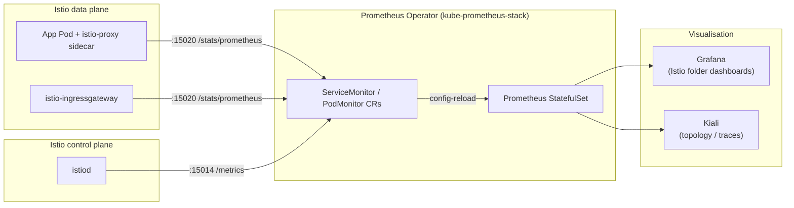

# Istio Observability Stack

This directory holds the **Istio Grafana dashboards** that visualise the metrics scraped
by Prometheus from the Istio mesh. It is one of three collaborating pieces in the
monitoring pipeline — see [How it works](#how-it-works) below.

> **For new developers**: start with the [TL;DR onboarding](#tldr-onboarding-for-new-developers)
> section, then come back to read the architecture.

---

## How it works



### Components & their repo paths

| Layer | What | Source | Deployed by |
|---|---|---|---|
| Data plane | Envoy sidecars, Ingress gateway | `argo-registry/qa/manifests/infra/istio-ingressgateway.yaml` | ArgoCD → Helm chart `gateway@1.23.6` |
| Control plane | `istiod` | `argo-registry/qa/manifests/infra/istiod.yaml` | ArgoCD → Helm chart `istiod@1.23.6` |
| CRDs | Istio base (Gateway, VirtualService, etc.) | `argo-registry/qa/manifests/infra/istio-base.yaml` | ArgoCD → Helm chart `base@1.23.6` |
| Scrape config | 3 × `ServiceMonitor` / `PodMonitor` CRs | [`monitoring/istio-servicemonitors/`](../istio-servicemonitors/) | ArgoCD App `istio-servicemonitors` (see [`istio-servicemonitors.yaml`](../../argo-registry/qa/manifests/infra/istio-servicemonitors.yaml)) |
| Prometheus + Grafana | TSDB + UI | `argo-registry/qa/manifests/infra/prometheus.yaml` | ArgoCD → Helm chart `kube-prometheus-stack@75.15.2` |
| Istio dashboards | Grafana JSON | **this directory** | see [Deployment options](#deployment-options) |
| Mesh topology UI | Kiali | `argo-registry/qa/manifests/infra/kiali.yaml` | ArgoCD → Helm chart `kiali-server@1.89.0` |

### Metric discovery flow (end-to-end)

1. **Envoy** exposes Prometheus metrics on port `15020` (data-plane pods) and `15014`
   (control plane). These endpoints publish `istio_requests_total`,
   `istio_request_duration_milliseconds`, `pilot_xds_pushes`, and ~100 others.
2. The three files in [`monitoring/istio-servicemonitors/`](../istio-servicemonitors/) —
   `servicemonitor-istiod.yaml`, `servicemonitor-envoy.yaml` (a `PodMonitor`), and
   `servicemonitor-ingress.yaml` — each carry the label
   ```yaml
   labels:
     release: prometheus
   ```
   which is the **selector the `kube-prometheus-stack` Prometheus CR uses**
   (`spec.serviceMonitorSelector.matchLabels.release=prometheus`).
3. The Prometheus Operator watches for CRs with that label and **hot-reloads the
   scrape config** — no Prometheus restart needed.
4. Scraped series land in Prometheus and are queryable from Grafana and Kiali.
5. **Grafana dashboards** in this directory then render those series.

---

## Deployment options

There are three ways to get the dashboards into Grafana. Pick exactly one.

### Option A — Grafana UI import (current default, simplest)

1. Open https://grafana.dev.cgraaaj.in (Authentik SSO).
2. **Dashboards → New → Import**.
3. Enter one of these IDs and click **Load**:

   | Dashboard | Grafana.com ID | Best for |
   |---|---|---|
   | Istio Mesh | `7639` | Global mesh health (RPS / success rate / 5xx) |
   | Istio Service | `7636` | Per-service RED metrics |
   | Istio Workload | `7630` | Per-workload (Deployment) metrics |
   | Istio Control Plane | `7645` | `istiod` push / config-sync health |
   | Istio Performance | `11829` | Latency percentiles, connection pools, circuit breakers |

4. Select the **Prometheus** data source and click **Import**.

This is the quickest path but the dashboards are **not in Git** — re-importing is a manual
step if the Grafana PVC is ever recreated.

### Option B — Sidecar-injected ConfigMaps (GitOps-native, recommended)

The `kube-prometheus-stack` Helm chart runs a Grafana **dashboard sidecar** that auto-discovers
`ConfigMap`s labelled `grafana_dashboard: "1"` across the cluster. To adopt this pattern:

1. Drop JSON files into this directory (`monitoring/istio-dashboards/*.json`).
2. Create `ConfigMap`s wrapping them (one per dashboard) with the sidecar label:
   ```yaml
   apiVersion: v1
   kind: ConfigMap
   metadata:
     name: istio-mesh-dashboard
     namespace: monitoring
     labels:
       grafana_dashboard: "1"
   data:
     istio-mesh.json: |
       <contents of istio-mesh-dashboard.json>
   ```
3. Commit them under `monitoring/istio-dashboards/` and the existing `bootstrap-qa`
   app-of-apps will pick them up automatically once a corresponding ArgoCD Application
   for `monitoring/istio-dashboards/` is added (**not yet wired — see
   [Pending work](#pending-work)**).

### Option C — Helm values (embedded in prometheus release)

Add the block below under `grafana:` in
[`argo-registry/qa/manifests/infra/prometheus.yaml`](../../argo-registry/qa/manifests/infra/prometheus.yaml):

```yaml
grafana:
  dashboardProviders:
    dashboardproviders.yaml:
      apiVersion: 1
      providers:
        - name: istio
          orgId: 1
          folder: Istio
          type: file
          disableDeletion: false
          editable: true
          options:
            path: /var/lib/grafana/dashboards/istio
  dashboards:
    istio:
      istio-mesh:          { gnetId: 7639,  revision: 202, datasource: Prometheus }
      istio-service:       { gnetId: 7636,  revision: 202, datasource: Prometheus }
      istio-workload:      { gnetId: 7630,  revision: 202, datasource: Prometheus }
      istio-control-plane: { gnetId: 7645,  revision: 202, datasource: Prometheus }
      istio-performance:   { gnetId: 11829, revision: 202, datasource: Prometheus }
```

`revision: 202` pins the dashboard to a known-good revision — bump only when intentionally
upgrading.

---

## TL;DR onboarding for new developers

```text
┌─────────────────────────────────────────────────────────────────────┐
│  You need Istio metrics in Grafana. Here is the 60-second version.  │
└─────────────────────────────────────────────────────────────────────┘
```

1. Verify the ServiceMonitors exist and are labelled correctly:

   ```bash
   kubectl -n istio-system get servicemonitor,podmonitor
   # Expected: istiod, istio-ingressgateway (ServiceMonitors), envoy-stats (PodMonitor)
   ```

2. Verify Prometheus is scraping them:

   ```bash
   kubectl -n monitoring port-forward svc/prometheus-kube-prometheus-prometheus 9090:9090
   # → open http://localhost:9090/targets
   # Look for UP targets: istiod, istio-ingressgateway, envoy-stats/*
   ```

3. Import dashboards via **Option A** above (2 minutes, no cluster changes).

4. Generate traffic through a mesh-injected namespace, e.g.:

   ```bash
   kubectl label namespace mediaradar istio-injection=enabled --overwrite
   kubectl -n mediaradar rollout restart deploy    # pods come back with sidecars
   # then issue some HTTP traffic against the app
   ```

5. Open the **Istio Service** dashboard in Grafana → charts should populate within 30 s.

---

## Recent changes (2026-04 cleanup)

This section documents what was changed so future devs don't repeat the same debugging.

| Change | Why | File(s) |
|---|---|---|
| Fixed broken `istio-servicemonitors` ArgoCD Application — it pointed at `https://github.com/cgraaaj/k3s-projects.git` branch `main`, which does not exist (the real remote is `k3s-infra.git` branch `master`). Added `include: servicemonitor-*.yaml` so the app never accidentally syncs a `README.md`. | Without this fix the ServiceMonitors had to be applied by hand; any drift was invisible. | [`argo-registry/qa/manifests/infra/istio-servicemonitors.yaml`](../../argo-registry/qa/manifests/infra/istio-servicemonitors.yaml) |
| Added `bootstrap-qa` app-of-apps that recursively syncs every `*.yaml` under `argo-registry/qa/manifests/` (excluding itself and the guestbook tutorial). | Before this, updating a chart version in Git required a follow-up `kubectl apply -f …` on each Application CR — the GitOps loop was open. Now every merged PR on `master` deploys automatically. | [`argo-registry/qa/manifests/bootstrap-qa.yaml`](../../argo-registry/qa/manifests/bootstrap-qa.yaml) |
| Added `ignoreDifferences` blocks to `istio-base` and `istiod` Applications for `ValidatingWebhookConfiguration.webhooks[].clientConfig.caBundle` and `MutatingWebhookConfiguration.webhooks[].clientConfig.caBundle`. | Istio injects its own CA bundle into the webhooks at runtime, which made ArgoCD permanently show them as `OutOfSync` even though the cluster was healthy. | [`istio-base.yaml`](../../argo-registry/qa/manifests/infra/istio-base.yaml), [`istiod.yaml`](../../argo-registry/qa/manifests/infra/istiod.yaml) |
| Bumped all three Istio charts `1.23.2 → 1.23.6` (in-minor patch) together with 4 other Tier-1 patches. | Kept behaviour identical (same minor) while picking up CVE/patch fixes. Major Istio upgrades (1.24–1.29) are gated behind the Renovate Dependency Dashboard because Istio does not support skipping more than 2 minors. | commit `96f0e9f` |
| Renovate rules hardened: Istio/Prometheus/Authentik minors & majors are now behind the Dependency Dashboard approval checkbox (no PR opens until you tick the box). | Prevents accidental `1.23 → 1.29` or `75 → 84` single-step jumps that would break the cluster. | [`renovate.json`](../../renovate.json) |
| Consolidated Istio root docs (5 files, ~1,612 lines of 192.168.1.x-era notes) into [`docs/istio/README.md`](../../docs/istio/README.md). | Root was cluttered with overlapping, outdated guides. | deleted in commit preceding `96f0e9f` |

### What still uses the old `monitoring/…` path and needs attention

These directories contain real resources in the cluster but are **not yet wired into ArgoCD**:

| Path | Current state | Recommended next step |
|---|---|---|
| [`monitoring/istio-dashboards/`](.) (JSON files) | Imported manually via Grafana UI (Option A) | Adopt Option B: convert each dashboard to a labelled `ConfigMap`, add an ArgoCD Application, let `bootstrap-qa` sync it |
| [`monitoring/alerts/`](../alerts/) | `PrometheusRule` CRs applied by hand | Add an ArgoCD Application pointing at this path |
| [`monitoring/alertmanager-router-config.yaml`](../alertmanager-router-config.yaml) | Applied manually | Ship via the `kube-prometheus-stack` Helm `alertmanager.config` field |
| [`monitoring/alert-router/`](../alert-router/) (Python webhook) | Deployed by hand via `build-deploy.sh` | Publish image to internal registry + reference from an ArgoCD Application |

---

## Verification

After any change to the scrape layer:

```bash
# 1. ServiceMonitors discovered by Prometheus?
kubectl -n istio-system get servicemonitor,podmonitor -o wide

# 2. Targets UP in Prometheus?
kubectl -n monitoring port-forward svc/prometheus-kube-prometheus-prometheus 9090:9090
# → http://localhost:9090/targets  (filter by job: envoy-stats | istiod | istio-ingressgateway)

# 3. Series present?
curl -sG 'http://localhost:9090/api/v1/query' \
  --data-urlencode 'query=sum(rate(istio_requests_total[5m]))'

# 4. Dashboards reachable?
open https://grafana.dev.cgraaaj.in            # should redirect through Authentik SSO
```

## Troubleshooting

| Symptom | Likely cause | Fix |
|---|---|---|
| **Targets DOWN in `/targets`** | ServiceMonitor missing the `release: prometheus` label, so the Prometheus CR's `serviceMonitorSelector` does not match it | Re-apply the ServiceMonitor with the correct label, or check `kubectl -n monitoring get prometheus prometheus-kube-prometheus-prometheus -o yaml \| grep serviceMonitorSelector -A3` |
| **"No data" in Istio dashboards** | Namespace is not mesh-injected, so no sidecar means no `istio_*` metrics | `kubectl label ns <name> istio-injection=enabled --overwrite` then restart the pods |
| **Dashboards show old data / freeze** | Prometheus retention is set to `6h` on this cluster (see [`prometheus.yaml`](../../argo-registry/qa/manifests/infra/prometheus.yaml) line `retention: 6h`). Normal. | Increase `retention` in the Helm values if longer history is needed — be mindful of Longhorn PVC size. |
| **Kiali shows empty graph** | Kiali queries Prometheus; if ServiceMonitors are wrong Kiali is also affected | Fix the ServiceMonitor path first; Kiali will recover. |
| **Grafana dashboard imports disappear on Grafana pod restart** | You used Option A (UI import) and the Grafana admin dashboards PVC was not persistent, or the dashboard was saved in-memory | Switch to Option B (sidecar `ConfigMap`) for permanent dashboards |
| **ArgoCD shows `istio-base`/`istiod` as OutOfSync** | Istio CA bundle injection drift | Should be silenced by the `ignoreDifferences` blocks added in 2026-04. If it returns, re-check those blocks are intact. |

## Pending work

- [ ] Convert the 5 Grafana dashboards in this directory to labelled `ConfigMap`s and wire an ArgoCD Application for `monitoring/istio-dashboards/` — fully GitOps-managed.
- [ ] Add `PrometheusRule` for Istio: high-cardinality labels, 5xx rate > 5 % for 5 m, pilot push errors > 0.
- [ ] Upgrade Istio along the supported path `1.23 → 1.24 → 1.25 → 1.26 → 1.27 → 1.28 → 1.29` via 6 sequential Renovate PRs (gated behind Dependency Dashboard).
- [ ] Export Kiali traces to Tempo / Jaeger (currently `sampling: 1.0` is set in `istiod.yaml` but there is no trace backend configured).

## References

- Official Istio observability guide: https://istio.io/latest/docs/tasks/observability/
- Prometheus Operator ServiceMonitor CRD: https://prometheus-operator.dev/docs/operator/api/#monitoring.coreos.com/v1.ServiceMonitor
- Grafana sidecar dashboard discovery: https://github.com/kiwigrid/k8s-sidecar
- Local docs: [`docs/istio/README.md`](../../docs/istio/README.md), [`monitoring/istio-servicemonitors/README.md`](../istio-servicemonitors/README.md), [`monitoring/README.md`](../README.md)
